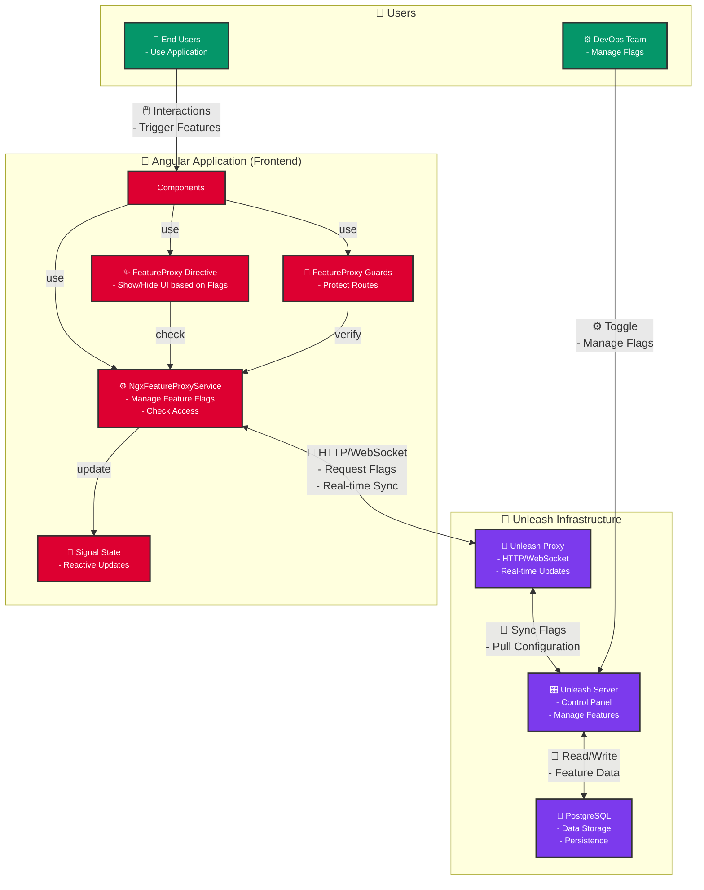

# 🚀 ngx-feature-proxy

<div align="center">


[](https://www.npmjs.com/package/ngx-feature-proxy)
[](https://www.npmjs.com/package/ngx-feature-proxy)
[](https://www.npmjs.com/package/ngx-feature-proxy)
[](https://www.npmjs.com/package/ngx-feature-proxy)

[](https://github.com/zenkiet/ngx-feature-proxy/issues)
[](https://github.com/zenkiet/ngx-feature-proxy/stargazers)
[](https://github.com/zenkiet/ngx-feature-proxy/actions)
[](LICENSE)

**🎯 Type-safe Angular Feature Flag Library with Unleash Integration**

_Reactive programming • Zero-configuration setup • Enterprise-ready_

[📦 NPM](https://www.npmjs.com/package/ngx-feature-proxy) • [🚀 Quick Start](#-quick-start) • [💬 Discussions](https://github.com/zenkiet/ngx-feature-proxy/discussions)

</div>

---

## 📑 Table of Contents

- [🌟 Features](#-features)
- [📖 What is Unleash?](#-what-is-unleash)
- [🏗️ Architecture](#️-architecture)
- [🚀 Quick Start](#-quick-start)
  - [📦 Installation](#-installation)
  - [⚙️ Basic Setup](#️-basic-setup)
  - [🎯 Your First Feature Flag](#-your-first-feature-flag)
- [🎮 Usage Guide](#-usage-guide)
  - [🔧 Service Usage](#-service-usage)
  - [🎨 Directive Usage](#-directive-usage)
    - [🎯 Simple Feature Check](#-simple-feature-check)
    - [🎯 Complex Feature Check](#-complex-feature-check)
  - [🛡️ Route Guards](#️-route-guards)
    - [🎪 Advanced Guard Patterns](#-advanced-guard-patterns)
- [🐳 Docker Setup with Unleash](#-docker-setup-with-unleash)
  - [🐳 Complete Docker Compose Setup](#-complete-docker-compose-setup)
  - [🌐 Access Your Unleash](#-access-your-unleash)
- [🤝 Contributing](#-contributing)
  - [🐛 Bug Reports](#-bug-reports)
  - [✨ Feature Requests](#-feature-requests)
  - [🛠️ Development Workflow](#️-development-workflow)
  - [📝 Commit Convention](#-commit-convention)
- [📄 License](#-license)
- [🙏 Acknowledgments](#-acknowledgments)
- [📞 Support](#-support)
  - [🤝 Get Help \& Connect](#-get-help--connect)
  - [📊 Project Stats](#-project-stats)
  - [🌟 Ready to get started?](#-ready-to-get-started)

---

## 🌟 Features

| Feature                    | Description                                  |
| -------------------------- | -------------------------------------------- |
| ✨ **Type-Safe**           | Full TypeScript support with strict typing   |
| 🚀 **Performance**         | Optimized with caching and smart updates     |
| 🛡️ **Route Protection**    | Support for guards to protect routes         |
| 🎨 **Template Directives** | Declarative feature flag usage in templates  |
| 🔧 **Flexible**            | Support for complex feature flag expressions |
| 🌐 **Enterprise Ready**    | Can be deployed in large-scale applications  |

## 📖 What is Unleash?

Unleash is an open-source feature flag management platform that enables you to:

| Capability                 | Benefit                                                            |
| -------------------------- | ------------------------------------------------------------------ |
| 🎛️ **Toggle Features**     | Enable/disable features instantly without deployments              |
| 🎯 **Targeted Rollouts**   | Gradual feature rollouts to specific user segments                 |
| 🧪 **A/B Testing**         | Run experiments with different feature variants                    |
| 📊 **Analytics**           | Track feature usage and performance metrics                        |
| 🔒 **Enterprise Security** | Role-based access control and audit logs                           |
| 🌍 **Multi-Environment**   | Separate feature configurations for **develop/staging/production** |

---

## 🏗️ Architecture



**🔄 How it Works:**

1. **🎯 Feature Definition**: DevOps team defines feature flags in Unleash Server
2. **📡 Real-time Sync**: Unleash Proxy pulls configurations and serves them via HTTP/WebSocket
3. **🔧 Angular Integration**: ngx-feature-proxy connects to Unleash Proxy using unleash-proxy-client
4. **📊 Reactive Updates**: Service uses Angular signals to provide real-time feature flag state
5. **🎨 Template Magic**: Directives and guards automatically react to feature flag changes
6. **👤 User Experience**: End users see features toggled instantly without page refreshes

---

## 🚀 Quick Start

### 📦 Installation

```bash
# 🚀 Install the library
npm install ngx-feature-proxy unleash-proxy-client
```

### ⚙️ Basic Setup

```typescript
// 📁 src/main.ts
import { bootstrapApplication } from '@angular/platform-browser';
import { provideFeatureProxy } from 'ngx-feature-proxy';
import { AppComponent } from './app/app.component';

bootstrapApplication(AppComponent, {
  providers: [
    // 🎯 Configure feature proxy
    provideFeatureProxy({
      url: 'http://localhost:3000/api/proxy', // 🌐 Your Unleash proxy URL
      clientKey: 'your-client-key', // 🔑 Your client key
      appName: 'my-angular-app', // 📱 Your app name

      // 🎛️ Optional: Advanced configuration
      context: {
        environment: 'development',
      },
      refreshInterval: 30, // ⏱️ Refresh interval in seconds
      metricsInterval: 60, // 📊 Metrics interval in seconds
    }),
    // ... other providers
  ],
});
```

### 🎯 Your First Feature Flag

```typescript
// 📁 src/app/app.component.ts
import { Component, inject } from '@angular/core';
import { NgxFeatureProxyService } from 'ngx-feature-proxy';

@Component({
  selector: 'app-root',
  template: `
    <div class="container">
      <!-- 🎨 Using directive -->
      <div *featureProxy="'newDashboard'">🆕 Welcome to the new dashboard!</div>

      <!-- 🎯 Using directive with expression -->
      <div *featureProxy="'premiumUser && (betaAccess || adminMode)'">
        🚀 Access to premium beta features!
      </div>

      <!-- 🔧 Using service -->
      @if (isNewfeatureProxy) {
        <button (click)="tryNewFeature()">✨ Try New Feature</button>
      }

      <!-- 🎭 State information -->
      <div class="debug-info">
        <p>🔄 Ready: {{ $state().ready }}</p>
        <p>⏰ Last Update: {{ $state().lastUpdate | date: 'medium' }}</p>
      </div>
    </div>
  `,
  standalone: true,
  imports: [FeatureProxyDirective],
})
export class AppComponent {
  private featureService = inject(NgxFeatureProxyService);

  // 🎯 Direct feature check
  isNewFeatureEnabled = this.featureService.isEnabled('newFeature');

  // 📊 Reactive state
  $state = this.featureService.$state;

  tryNewFeature() {
    console.log('🚀 New feature activated!');
  }
}
```

---

## 🎮 Usage Guide

### 🔧 Service Usage

The `NgxFeatureProxyService` is the core of the library, providing programmatic access to feature flags:

```typescript
import { Component, inject, computed, effect } from '@angular/core';
import { NgxFeatureProxyService } from 'ngx-feature-proxy';

@Component({
  selector: 'app-feature-demo',
  template: `
    <div class="feature-demo">
      <!-- 📊 Service state -->
      <div class="status-bar">
        <span
          class="status"
          [class.ready]="$state().ready"
        >
          {{ $state().ready ? '🟢 Connected' : '🟡 Connecting...' }}
        </span>
        <span class="last-update"> 📅 Last update: {{ $state().lastUpdate | date: 'short' }} </span>
      </div>

      <!-- 🎯 Feature checks -->
      <div class="features">
        <div class="feature-card">
          <h3>🆕 Beta Features</h3>
          <p>Status: {{ betaEnabled ? '✅ Enabled' : '❌ Disabled' }}</p>
          <button
            [disabled]="!betaEnabled"
            (click)="useBetaFeature()"
          >
            Try Beta Feature
          </button>
        </div>

        <!-- 🎭 Variant example -->
        <div
          class="feature-card"
          *ngIf="premiumVariant.enabled"
        >
          <h3>💎 Premium Feature</h3>
          <p>Variant: {{ premiumVariant.name }}</p>
          <div [style.background-color]="premiumVariant.payload.value">
            Theme: {{ premiumVariant.payload.value }}
          </div>
        </div>
      </div>
    </div>
  `,
  standalone: true,
})
export class FeatureDemoComponent {
  private featureService = inject(NgxFeatureProxyService);

  // 📊 Reactive state
  $state = this.featureService.$state;

  // 🎯 Simple feature check
  betaEnabled = computed(() => this.featureService.isEnabled('betaFeatures'));

  // 🎭 Get variant with payload
  premiumVariant = computed(() => this.featureService.getVariant('premiumTheme'));

  // 🔄 Complex feature expression
  advancedMode = computed(() =>
    this.featureService.features('premiumUser && (betaAccess || adminMode)')
  );

  constructor() {
    // 👂 React to impression events
    effect(() => {
      const impression = this.featureService.$impression();
      if (impression.eventType === 'isEnabled') {
        console.log('🎯 Feature accessed:', impression.featureName);
      }
    });
  }

  useBetaFeature() {
    console.log('🧪 Beta feature activated!');
  }

  // 🔄 Update user context
  async updateUserContext(userId: string) {
    await this.featureService.updateContext({ userId }).toPromise();
    console.log('👤 User context updated');
  }

  // 📡 Manual refresh
  async refreshFlags() {
    await this.featureService.refresh().toPromise();
    console.log('🔄 Feature flags refreshed');
  }
}
```

### 🎨 Directive Usage

The `*featureEnabled` directive provides declarative feature flag control in templates:

#### 🎯 Simple Feature Check

```html
<div *featureEnabled="'newDashboard'">🆕 Welcome to the new dashboard!</div>
```

#### 🎯 Complex Feature Check

```html
<div *featureEnabled="'premiumUser && (betaAccess || adminMode)'">
  🚀 Access to premium beta features!
</div>
```

### 🛡️ Route Guards

Protect your routes with feature flag-based guards:

```typescript
import { Routes } from '@angular/router';
import { featureProxyGuard } from 'ngx-feature-proxy';

export const routes: Routes = [
  {
    path: 'dashboard',
    loadComponent: () => import('./dashboard/dashboard.component'),
    canActivate: [
      // 🎯 Simple feature guard
      featureProxyGuard({
        expression: 'newDashboard',
        redirectTo: '/legacy-dashboard',
      }),
    ],
  },
  {
    path: 'admin',
    loadChildren: () => import('./admin/admin.routes'),
    canActivate: [
      // 🛡️ Complex permission guard
      featureProxyGuard({
        expression: 'adminAccess && (betaTester || superUser)',
        redirectTo: '/not-authorized',
      }),
    ],
  },
  {
    path: 'user',
    loadComponent: () => import('./user/user.component'),
    canActivate: [
      // 👤 User-specific feature guard
      featureProxyGuard({
        condition: (service) => service.isEnabled('userFeatures') && service.getVariant('userTier').name === 'gold',
        redirectTo: '/upgrade',
      }),
    ],
  }
  {
    path: 'premium',
    loadChildren: () => import('./premium/premium.routes'),
    canActivateChild: [
      // 💎 Premium feature guard for child routes
      featureProxyGuard({
        expression: 'premiumUser && validSubscription',
        redirectTo: '/subscribe',
      }),
    ],
  },
];
```

#### 🎪 Advanced Guard Patterns

```typescript
// 🔧 Custom guard with complex logic
export const premiumGuard = featureProxyGuard({
  condition: (service) => {
    const isPremium = service.isEnabled('premiumUser');
    const isValidSubscription = service.isEnabled('validSubscription');
    const variant = service.getVariant('premiumTier');

    return isPremium && isValidSubscription && ['gold', 'platinum'].includes(variant.name);
  },
  redirectTo: '/upgrade',
});

// 🌍 Geo-based feature guard
export const geoFeatureGuard = featureProxyGuard({
  condition: (service) => {
    return service.features('featureEnabled && (region_US || region_EU)');
  },
  redirectTo: '/geo-restricted',
});

// 📱 Device-specific guard
export const mobileFeatureGuard = featureProxyGuard({
  condition: (service) => {
    const isMobile = service.getVariant('deviceType').name === 'mobile';
    return isMobile && service.isEnabled('mobileFeatures');
  },
  redirectTo: '/desktop-only',
});
```

---

## 🐳 Docker Setup with Unleash

### 🐳 Complete Docker Compose Setup

Create a `docker-compose.yml` file for a complete Unleash setup:

```yaml
# 🐳 docker-compose.yml
services:
  unleash:
    image: unleashorg/unleash-server:${UNLEASH_VERSION:-6}
    container_name: unleash
    restart: ${RESTART_POLICY:-unless-stopped}
    ports:
      - '4242:4242'
    networks:
      - unleash_net
    environment:
      # 🗄️ Database configuration
      DATABASE_URL: 'postgres://postgres:${UNLEASH_DATABASE_PASSWORD:-unleash}@unleash-db/postgres'
      DATABASE_SSL: 'false'

      # 📊 Logging and performance
      LOG_LEVEL: 'warn'

      # 🔑 API tokens (generate secure tokens for production)
      INIT_FRONTEND_API_TOKENS: ${INIT_FRONTEND_API_TOKENS:-*:*.unleash-insecure-frontend-api-token}
      INIT_BACKEND_API_TOKENS: ${INIT_BACKEND_API_TOKENS:-*:*.unleash-insecure-api-token}

      # 🌐 Server configuration
      UNLEASH_URL: 'https://${UNLEASH_DOMAIN:-localhost:4242}'

      # 👤 Default admin credentials
      UNLEASH_DEFAULT_ADMIN_PASSWORD: ${UNLEASH_DEFAULT_ADMIN_PASSWORD:-admin123}
      UNLEASH_DEFAULT_ADMIN_USERNAME: ${UNLEASH_DEFAULT_ADMIN_USERNAME:-admin}

      # ⚡ Performance optimizations
      UNLEASH_PROXY_SECRETS: ${UNLEASH_PROXY_SECRETS:-some-secret}
    depends_on:
      unleash-db:
        condition: service_healthy
    healthcheck:
      test: wget --no-verbose --tries=1 --spider http://localhost:4242/health || exit 1
      interval: 1s
      timeout: 1m
      retries: 5
      start_period: 15s
    volumes:
      # 📁 Optional: Custom configuration
      - ./unleash-config:/opt/unleash/config:ro

  unleash-db:
    image: postgres:17-alpine
    container_name: unleash-db
    restart: ${RESTART_POLICY:-unless-stopped}
    volumes:
      - ${DATA_PATH:-./data}/unleash/postgresql/data:/var/lib/postgresql/data
    expose:
      - '5432'
    networks:
      - unleash_net
    environment:
      - POSTGRES_DB=postgres
      - POSTGRES_USER=postgres
      - POSTGRES_PASSWORD=${UNLEASH_DATABASE_PASSWORD:-unleash123}
    healthcheck:
      test: ['CMD', 'pg_isready', '--username=postgres', '--host=127.0.0.1', '--port=5432']
      interval: 2s
      timeout: 1m
      retries: 5
      start_period: 10s

  # 🚀 Optional: Unleash Proxy (for better performance)
  unleash-proxy:
    image: unleashorg/unleash-proxy:latest
    container_name: unleash-proxy
    restart: ${RESTART_POLICY:-unless-stopped}
    ports:
      - '3000:3000'
    networks:
      - unleash_net
    environment:
      UNLEASH_URL: 'http://unleash:4242/api'
      UNLEASH_API_TOKEN: ${INIT_BACKEND_API_TOKENS:-*:*.unleash-insecure-api-token}
      UNLEASH_APP_NAME: 'unleash-proxy'
      UNLEASH_INSTANCE_ID: 'unleash-proxy-1'
    depends_on:
      unleash:
        condition: service_healthy

networks:
  unleash_net:
    driver: bridge

volumes:
  unleash_data:
    driver: local
```

Create a `.env` file for easy configuration:

```bash
# 📁 .env
# 🐳 Docker configuration
UNLEASH_VERSION=5.7
RESTART_POLICY=unless-stopped
DATA_PATH=./data

# 🌐 Domain and URLs
UNLEASH_DOMAIN=localhost:4242

# 🗄️ Database
UNLEASH_DATABASE_PASSWORD=unleash123

# 👤 Admin credentials (CHANGE IN PRODUCTION!)
UNLEASH_DEFAULT_ADMIN_USERNAME=admin
UNLEASH_DEFAULT_ADMIN_PASSWORD=admin123

# 🔑 API Tokens (GENERATE SECURE TOKENS FOR PRODUCTION!)
INIT_FRONTEND_API_TOKENS=*:development.unleash-insecure-frontend-api-token
INIT_BACKEND_API_TOKENS=*:development.unleash-insecure-api-token
UNLEASH_PROXY_SECRETS=proxy-secret-123

# 🎯 Optional: Context fields
UNLEASH_CONTEXT_FIELDS=userId,sessionId,environment,region
```

Commands to manage the Docker setup:

```bash
# 🏃 Start the stack
docker-compose up -d

# 📊 View logs
docker-compose logs -f unleash

# 🔍 Check health
docker-compose ps

# 🗑️ Clean up
docker-compose down -v

# 📈 Scale proxy (for high traffic)
docker-compose up -d --scale unleash-proxy=3
```

### 🌐 Access Your Unleash

After running `docker-compose up -d`:

- **🎛️ Unleash Dashboard**: http://localhost:4242
- **🔑 Login**: admin / admin123 (or your configured credentials)
- **⚡ Proxy Endpoint**: http://localhost:3000/proxy
- **📊 Health Check**: http://localhost:4242/health

---

## 🤝 Contributing

We welcome contributions! Here's how you can help:

### 🐛 Bug Reports

1. 🔍 Search existing issues
2. 📝 Create detailed bug report
3. 🏷️ Use appropriate labels

### ✨ Feature Requests

1. 💡 Discuss in GitHub Discussions
2. 📋 Create feature request issue
3. 🚀 Submit pull request

### 🛠️ Development Workflow

```bash
# 🍴 Fork and clone
git clone https://github.com/your-username/ngx-feature-proxy.git
cd ngx-feature-proxy

# 🌿 Create feature branch
git checkout -b feat/amazing-feature

# ✅ Commit changes
git commit -m "✨ Add amazing feature"

# 🚀 Push and create PR
git push origin feat/amazing-feature
```

### 📝 Commit Convention

We use [Conventional Commits](https://www.conventionalcommits.org/):

- `✨ feat:` New features
- `🐛 fix:` Bug fixes
- `📚 docs:` Documentation
- `🎨 style:` Code formatting
- `♻️ refactor:` Code restructuring
- `🚀 perf:` Performance improvements
- `🚨 test:` Testing
- `🔧 chore:` Maintenance

---

## 📄 License

This project is licensed under the **MIT License** - see the [LICENSE](LICENSE) file for details.

```
MIT License

Copyright (c) 2025 Kiet Le

Permission is hereby granted, free of charge, to any person obtaining a copy
of this software and associated documentation files (the "Software"), to deal
in the Software without restriction, including without limitation the rights
to use, copy, modify, merge, publish, distribute, sublicense, and/or sell
copies of the Software, and to permit persons to whom the Software is
furnished to do so, subject to the following conditions:

The above copyright notice and this permission notice shall be included in all
copies or substantial portions of the Software.

THE SOFTWARE IS PROVIDED "AS IS", WITHOUT WARRANTY OF ANY KIND, EXPRESS OR
IMPLIED, INCLUDING BUT NOT LIMITED TO THE WARRANTIES OF MERCHANTABILITY,
FITNESS FOR A PARTICULAR PURPOSE AND NONINFRINGEMENT. IN NO EVENT SHALL THE
AUTHORS OR COPYRIGHT HOLDERS BE LIABLE FOR ANY CLAIM, DAMAGES OR OTHER
LIABILITY, WHETHER IN AN ACTION OF CONTRACT, TORT OR OTHERWISE, ARISING FROM,
OUT OF OR IN CONNECTION WITH THE SOFTWARE OR THE USE OR OTHER DEALINGS IN THE
SOFTWARE.
```

---

## 🙏 Acknowledgments

This project wouldn't be possible without these amazing technologies:

<table>
<tr>
<td align="center" width="150px">

<br><strong><a href="https://angular.dev">Angular</a></strong>
<br><em>The best Framework ever</em>
</td>

<td align="center" width="150px">

<br><strong><a href="https://rxjs.dev">RxJS</a></strong>
<br><em>Reactive Programming</em>
</td>

<td align="center" width="150px">

<br><strong><a href="https://www.getunleash.io/">Unleash</a></strong>
<br><em>Feature Flag Management</em>
</td>

<td align="center" width="150px">

<br><strong><a href="https://www.docker.com/">Docker</a></strong>
<br><em>Containerization</em>
</td>
</tr>
</table>

---

## 📞 Support

<div align="center">

### 🤝 Get Help & Connect

[](mailto:zenkiet0906@gmail.com)
[](https://github.com/zenkiet/ngx-feature-proxy/issues)
[](https://github.com/zenkiet/ngx-feature-proxy/discussions)
[](https://hub.docker.com/r/zenkiet/ngx-feature-proxy)

### 📊 Project Stats


---

<div align="center">

### 🌟 Ready to get started?

**[📦 Install Now](https://www.npmjs.com/package/ngx-feature-proxy) • [📖 View Docs](#-table-of-contents) • [💬 Join Discussion](https://github.com/zenkiet/ngx-feature-proxy/discussions)**

---

**⭐ If this project helped you, please consider giving it a star! ⭐**

_Made with ❤️ by [ZenKiet](https://github.com/zenkiet)_

</div>
