# 🚀 ngx-feature-proxy

<div align="center">


[](https://www.npmjs.com/package/ngx-feature-proxy)
[](https://www.npmjs.com/package/ngx-feature-proxy)
[](https://www.npmjs.com/package/ngx-feature-proxy)
[](https://www.npmjs.com/package/ngx-feature-proxy)

[](https://github.com/zenkiet/ngx-feature-proxy/issues)
[](https://github.com/zenkiet/ngx-feature-proxy/stargazers)
[](https://github.com/zenkiet/ngx-feature-proxy/actions)
[](LICENSE)

**🎯 Type-safe Angular Feature Flag Library with Unleash Integration**

*Reactive programming • Zero-configuration setup • Enterprise-ready*

[📦 NPM](https://www.npmjs.com/package/ngx-feature-proxy) • [🚀 Quick Start](#-quick-start) • [💬 Discussions](https://github.com/zenkiet/ngx-feature-proxy/discussions)

</div>

---

## 📑 Table of Contents

- [🌟 Features](#-features)
- [📖 What is Unleash?](#-what-is-unleash)
- [🏗️ Architecture](#️-architecture)
- [🚀 Quick Start](#-quick-start)
- [⚙️ Configuration](#️-configuration)
- [🎮 Usage Guide](#-usage-guide)
  - [🔧 Service Usage](#-service-usage)
  - [🎨 Directive Usage](#-directive-usage)
  - [🛡️ Route Guards](#️-route-guards)
- [🐳 Docker Setup with Unleash](#-docker-setup-with-unleash)
- [🔄 Reactive Programming](#-reactive-programming)
- [📱 Advanced Examples](#-advanced-examples)
- [🏆 Best Practices](#-best-practices)
- [🐛 Troubleshooting](#-troubleshooting)
- [🤝 Contributing](#-contributing)
- [📄 License](#-license)

---

## 🌟 Features

- ✨ **Type-Safe**: Full TypeScript support with strict typing
- 🔄 **Reactive**: Built-in Angular signals and RxJS integration
- 🎯 **Zero Config**: Works out of the box with sensible defaults
- 🚀 **Performance**: Optimized with caching and smart updates
- 🛡️ **Route Protection**: Built-in route guards for feature gating
- 🎨 **Template Directives**: Declarative feature flag usage in templates
- 📊 **Analytics**: Built-in impression tracking and metrics
- 🔧 **Flexible**: Support for complex feature flag expressions
- 🌐 **Enterprise Ready**: Production-tested with Unleash integration

---

## 📖 What is Unleash?

[**Unleash**](https://www.getunleash.io/) 🚀 is an open-source feature flag management platform that enables you to:

- 🎛️ **Toggle Features**: Enable/disable features instantly without deployments
- 🎯 **Targeted Rollouts**: Gradual feature rollouts to specific user segments
- 🧪 **A/B Testing**: Run experiments with different feature variants
- 📊 **Analytics**: Track feature usage and performance metrics
- 🔒 **Enterprise Security**: Role-based access control and audit logs
- 🌍 **Multi-Environment**: Separate feature configurations for dev/staging/prod

---

## 🏗️ Architecture

```mermaid
graph TB
    subgraph "🏢 Your Angular Application"
        A["`🎯 **Angular App**
        Components & Services`"]
        B["`🔧 **NgxFeatureProxyService**
        Feature Flag Management`"]
        C["`🎨 **FeatureEnabled Directive**
        Template Controls`"]
        D["`🛡️ **FeatureProxy Guards**
        Route Protection`"]
        E["`📊 **Signal State Management**
        Reactive Updates`"]
    end

    subgraph "🌐 Unleash Infrastructure"
        F["`⚡ **Unleash Proxy**
        Edge Server`"]
        G["`🏛️ **Unleash Server**
        Control Panel`"]
        H["`🗄️ **PostgreSQL**
        Feature Storage`"]
    end

    subgraph "👥 User Interaction"
        I["`👤 **End Users**
        Application Usage`"]
        J["`⚙️ **DevOps Team**
        Feature Management`"]
    end

    %% Application Flow
    A --> B
    A --> C
    A --> D
    B --> E
    C --> B
    D --> B

    %% External Communication
    B <-->|"`📡 **HTTP/WebSocket**
    Real-time Updates`"| F
    F <-->|"`🔄 **Flag Sync**
    Configuration Pull`"| G
    G <-->|"`💾 **Data Persistence**
    Feature Storage`"| H

    %% User Interaction
    I -->|"`🖱️ **User Actions**
    Feature Usage`"| A
    J -->|"`⚙️ **Flag Management**
    Toggle Features`"| G

    %% Styling
    classDef angular fill:#dd0031,stroke:#ffffff,stroke-width:2px,color:#ffffff
    classDef unleash fill:#7c3aed,stroke:#ffffff,stroke-width:2px,color:#ffffff
    classDef users fill:#059669,stroke:#ffffff,stroke-width:2px,color:#ffffff

    class A,B,C,D,E angular
    class F,G,H unleash
    class I,J users
```



**🔄 How it Works:**

1. **🎯 Feature Definition**: DevOps team defines feature flags in Unleash Server
2. **📡 Real-time Sync**: Unleash Proxy pulls configurations and serves them via HTTP/WebSocket
3. **🔧 Angular Integration**: ngx-feature-proxy connects to Unleash Proxy using unleash-proxy-client
4. **📊 Reactive Updates**: Service uses Angular signals to provide real-time feature flag state
5. **🎨 Template Magic**: Directives and guards automatically react to feature flag changes
6. **👤 User Experience**: End users see features toggled instantly without page refreshes

---

## 🚀 Quick Start

### 📦 Installation

```bash
# 🚀 Install the library
npm install ngx-feature-proxy

# 📚 Install peer dependencies (if not already installed)
npm install unleash-proxy-client
```

### ⚙️ Basic Setup

```typescript
// 📁 src/main.ts
import { bootstrapApplication } from '@angular/platform-browser';
import { provideFeatureProxy } from 'ngx-feature-proxy';
import { AppComponent } from './app/app.component';

bootstrapApplication(AppComponent, {
  providers: [
    // 🎯 Configure feature proxy
    provideFeatureProxy({
      url: 'http://localhost:3000/api/proxy', // 🌐 Your Unleash proxy URL
      clientKey: 'your-client-key', // 🔑 Your client key
      appName: 'my-angular-app', // 📱 Your app name

      // 🎛️ Optional: Advanced configuration
      refreshInterval: 30, // ⏱️ Refresh interval in seconds
      metricsInterval: 60, // 📊 Metrics interval in seconds
      context: {
        userId: 'user-123',
        sessionId: 'session-456',
        environment: 'development'
      }
    }),
    // ... other providers
  ],
});
```

### 🎯 Your First Feature Flag

```typescript
// 📁 src/app/app.component.ts
import { Component, inject } from '@angular/core';
import { NgxFeatureProxyService } from 'ngx-feature-proxy';

@Component({
  selector: 'app-root',
  template: `
    <div class="container">
      <!-- 🎨 Using directive -->
      <div *featureEnabled="'newDashboard'">
        🆕 Welcome to the new dashboard!
      </div>

      <!-- 🔧 Using service -->
      @if (isNewFeatureEnabled) {
        <button (click)="tryNewFeature()">
          ✨ Try New Feature
        </button>
      }

      <!-- 🎭 State information -->
      <div class="debug-info">
        <p>🔄 Ready: {{ $state().ready }}</p>
        <p>⏰ Last Update: {{ $state().lastUpdate | date:'medium' }}</p>
      </div>
    </div>
  `,
  standalone: true,
  imports: [FeatureEnabledDirective, CommonModule]
})
export class AppComponent {
  private featureService = inject(NgxFeatureProxyService);

  // 🎯 Direct feature check
  isNewFeatureEnabled = this.featureService.isEnabled('newFeature');

  // 📊 Reactive state
  $state = this.featureService.$state;

  tryNewFeature() {
    console.log('🚀 New feature activated!');
  }
}
```

---

## ⚙️ Configuration

### 🎛️ Basic Configuration

```typescript
import { provideFeatureProxy, NgxFeatureProxyConfig } from 'ngx-feature-proxy';

const config: NgxFeatureProxyConfig = {
  url: 'http://localhost:4242/api/proxy', // 🌐 Unleash proxy URL
  clientKey: 'your-frontend-token', // 🔑 Frontend API token
  appName: 'my-app', // 📱 Application identifier

  // 🎯 Context for targeting
  context: {
    userId: 'user-123',
    sessionId: 'session-abc',
    environment: 'production',
    properties: {
      region: 'US',
      plan: 'premium'
    }
  },

  // ⏱️ Update intervals
  refreshInterval: 15, // Fetch toggles every 15s
  metricsInterval: 60, // Send metrics every 60s

  // 📊 Analytics
  disableMetrics: false, // Enable usage metrics

  // 🚀 Bootstrap (for faster initial load)
  bootstrap: [
    { name: 'feature1', enabled: true, variant: { name: 'blue' } }
  ],
  bootstrapOverride: false // Don't override server values
};

// 🏗️ Apply configuration
export const appConfig = {
  providers: [
    provideFeatureProxy(config)
  ]
};
```

### 🌍 Environment-specific Configuration

```typescript
// 📁 src/environments/environment.ts
export const environment = {
  production: false,
  unleash: {
    url: 'http://localhost:4242/api/proxy',
    clientKey: 'development-token',
    context: {
      environment: 'development'
    }
  }
};

// 📁 src/environments/environment.prod.ts
export const environment = {
  production: true,
  unleash: {
    url: 'https://unleash.yourcompany.com/api/proxy',
    clientKey: 'production-token',
    context: {
      environment: 'production'
    }
  }
};

// 📁 src/main.ts
import { environment } from './environments/environment';

bootstrapApplication(AppComponent, {
  providers: [
    provideFeatureProxy({
      ...environment.unleash,
      appName: 'my-app'
    })
  ]
});
```

---

## 🎮 Usage Guide

### 🔧 Service Usage

The `NgxFeatureProxyService` is the core of the library, providing programmatic access to feature flags:

```typescript
import { Component, inject, computed, effect } from '@angular/core';
import { NgxFeatureProxyService } from 'ngx-feature-proxy';

@Component({
  selector: 'app-feature-demo',
  template: `
    <div class="feature-demo">
      <!-- 📊 Service state -->
      <div class="status-bar">
        <span class="status" [class.ready]="$state().ready">
          {{ $state().ready ? '🟢 Connected' : '🟡 Connecting...' }}
        </span>
        <span class="last-update">
          📅 Last update: {{ $state().lastUpdate | date:'short' }}
        </span>
      </div>

      <!-- 🎯 Feature checks -->
      <div class="features">
        <div class="feature-card">
          <h3>🆕 Beta Features</h3>
          <p>Status: {{ betaEnabled ? '✅ Enabled' : '❌ Disabled' }}</p>
          <button [disabled]="!betaEnabled" (click)="useBetaFeature()">
            Try Beta Feature
          </button>
        </div>

        <!-- 🎭 Variant example -->
        <div class="feature-card" *ngIf="premiumVariant.enabled">
          <h3>💎 Premium Feature</h3>
          <p>Variant: {{ premiumVariant.name }}</p>
          <div [style.background-color]="premiumVariant.payload.value">
            Theme: {{ premiumVariant.payload.value }}
          </div>
        </div>
      </div>
    </div>
  `,
  standalone: true
})
export class FeatureDemoComponent {
  private featureService = inject(NgxFeatureProxyService);

  // 📊 Reactive state
  $state = this.featureService.$state;

  // 🎯 Simple feature check
  betaEnabled = computed(() => this.featureService.isEnabled('betaFeatures'));

  // 🎭 Get variant with payload
  premiumVariant = computed(() => this.featureService.getVariant('premiumTheme'));

  // 🔄 Complex feature expression
  advancedMode = computed(() =>
    this.featureService.features('premiumUser && (betaAccess || adminMode)')
  );

  constructor() {
    // 👂 React to impression events
    effect(() => {
      const impression = this.featureService.$impression();
      if (impression.eventType === 'isEnabled') {
        console.log('🎯 Feature accessed:', impression.featureName);
      }
    });
  }

  useBetaFeature() {
    console.log('🧪 Beta feature activated!');
  }

  // 🔄 Update user context
  async updateUserContext(userId: string) {
    await this.featureService.updateContext({ userId }).toPromise();
    console.log('👤 User context updated');
  }

  // 📡 Manual refresh
  async refreshFlags() {
    await this.featureService.refresh().toPromise();
    console.log('🔄 Feature flags refreshed');
  }
}
```

### 🎨 Directive Usage

The `*featureEnabled` directive provides declarative feature flag control in templates:

#### 🎯 Simple Feature Check

```html
<!-- ✅ Single feature -->
<div *featureEnabled="'newDashboard'">
  🆕 Welcome to the new dashboard!
</div>

<!-- ❌ Feature disabled state -->
<div *featureEnabled="'newDashboard'; else: oldDashboard">
  🆕 New Dashboard
</div>
<ng-template #oldDashboard>
  📊 Classic Dashboard
</ng-template>
```

#### 🎭 Multiple Features (OR Logic)

```html
<!-- 🎯 Any feature enabled (OR) -->
<div *featureEnabled="['premiumFeatures', 'betaAccess', 'adminMode']">
  💎 You have access to advanced features!
</div>

<div *featureEnabled="['feature1', 'feature2']; else: noAccess">
  ✨ Advanced Content
</div>
<ng-template #noAccess>
  🔒 Please upgrade your plan
</ng-template>
```

#### 🧠 Complex Boolean Expressions

```html
<!-- 🎪 Complex logic with AND/OR/NOT -->
<div *featureEnabled="'premiumUser && (betaAccess || adminMode)'">
  🚀 Premium Beta Features
</div>

<div *featureEnabled="'featureA && featureB && !maintenanceMode'">
  🎯 Full Feature Set Available
</div>

<!-- 🎨 Nested conditions -->
<div *featureEnabled="'(userType_premium || userType_enterprise) && !maintenanceMode && region_US'">
  🇺🇸 US Premium Features
</div>
```

#### 🎨 Advanced Template Patterns

```html
<!-- 🎪 Feature flag with loading states -->
<div class="feature-container">
  <div *featureEnabled="'loadingFeature'" class="loading-wrapper">
    <div class="spinner">⏳</div>
    <p>Loading advanced features...</p>
  </div>

  <div *featureEnabled="'newUI && !loadingFeature'; else: legacyUI">
    <!-- 🆕 New UI components -->
    <app-modern-dashboard></app-modern-dashboard>
  </div>

  <ng-template #legacyUI>
    <!-- 📊 Legacy UI -->
    <app-classic-dashboard></app-classic-dashboard>
  </ng-template>
</div>

<!-- 🎭 Progressive enhancement -->
<div class="progressive-features">
  <!-- 🎯 Basic feature -->
  <app-basic-search></app-basic-search>

  <!-- ⭐ Enhanced search -->
  <div *featureEnabled="'advancedSearch'">
    <app-advanced-filters></app-advanced-filters>
    <app-saved-searches></app-saved-searches>
  </div>

  <!-- 💎 Premium search -->
  <div *featureEnabled="'premiumSearch && advancedSearch'">
    <app-ai-powered-search></app-ai-powered-search>
  </div>
</div>
```

### 🛡️ Route Guards

Protect your routes with feature flag-based guards:

```typescript
import { Routes } from '@angular/router';
import { featureProxyGuard } from 'ngx-feature-proxy';

export const routes: Routes = [
  {
    path: 'dashboard',
    loadComponent: () => import('./dashboard/dashboard.component'),
    canActivate: [
      // 🎯 Simple feature guard
      featureProxyGuard(
        (service) => service.isEnabled('newDashboard'),
        '/legacy-dashboard' // 🔄 Redirect if disabled
      )
    ]
  },
  {
    path: 'admin',
    loadChildren: () => import('./admin/admin.routes'),
    canActivate: [
      // 🛡️ Complex permission guard
      featureProxyGuard(
        (service) => service.features('adminAccess && !maintenanceMode'),
        '/unauthorized'
      )
    ]
  },
  {
    path: 'beta-features',
    loadComponent: () => import('./beta/beta.component'),
    canActivate: [
      // 🧪 Beta access guard
      featureProxyGuard((service) => {
        const variant = service.getVariant('betaProgram');
        return variant.enabled && variant.name === 'earlyAccess';
      })
    ]
  },
  {
    path: 'premium',
    loadChildren: () => import('./premium/premium.routes'),
    canActivateChild: [
      // 💎 Premium feature guard for child routes
      featureProxyGuard(
        (service) => service.isEnabled('premiumFeatures')
      )
    ]
  }
];
```

#### 🎪 Advanced Guard Patterns

```typescript
// 🔧 Custom guard with complex logic
export const premiumGuard = featureProxyGuard((service) => {
  const isPremium = service.isEnabled('premiumUser');
  const isValidSubscription = service.isEnabled('validSubscription');
  const variant = service.getVariant('premiumTier');

  return isPremium && isValidSubscription &&
         ['gold', 'platinum'].includes(variant.name);
}, '/upgrade');

// 🌍 Geo-based feature guard
export const geoFeatureGuard = featureProxyGuard((service) => {
  return service.features('featureEnabled && (region_US || region_EU)');
}, '/geo-restricted');

// 📱 Device-specific guard
export const mobileFeatureGuard = featureProxyGuard((service) => {
  const mobileEnabled = service.isEnabled('mobileFeatures');
  const isMobile = window.innerWidth < 768; // Simple mobile check
  return mobileEnabled || !isMobile;
});
```

---

## 🐳 Docker Setup with Unleash

### 🐳 Complete Docker Compose Setup

Create a `docker-compose.yml` file for a complete Unleash setup:

```yaml
# 🐳 docker-compose.yml
version: '3.8'

services:
  unleash:
    image: unleashorg/unleash-server:${UNLEASH_VERSION:-5.7}
    container_name: unleash
    restart: ${RESTART_POLICY:-unless-stopped}
    ports:
      - "4242:4242"
    networks:
      - unleash_net
    environment:
      # 🗄️ Database configuration
      DATABASE_URL: "postgres://postgres:${UNLEASH_DATABASE_PASSWORD:-unleash123}@unleash-db/postgres"
      DATABASE_SSL: "false"

      # 📊 Logging and performance
      LOG_LEVEL: "warn"

      # 🔑 API tokens (generate secure tokens for production)
      INIT_FRONTEND_API_TOKENS: ${INIT_FRONTEND_API_TOKENS:-*:*.unleash-insecure-frontend-api-token}
      INIT_BACKEND_API_TOKENS: ${INIT_BACKEND_API_TOKENS:-*:*.unleash-insecure-api-token}

      # 🌐 Server configuration
      UNLEASH_URL: "https://${UNLEASH_DOMAIN:-localhost:4242}"

      # 👤 Default admin credentials
      UNLEASH_DEFAULT_ADMIN_PASSWORD: ${UNLEASH_DEFAULT_ADMIN_PASSWORD:-admin123}
      UNLEASH_DEFAULT_ADMIN_USERNAME: ${UNLEASH_DEFAULT_ADMIN_USERNAME:-admin}

      # ⚡ Performance optimizations
      UNLEASH_PROXY_SECRETS: ${UNLEASH_PROXY_SECRETS:-some-secret}

    depends_on:
      unleash-db:
        condition: service_healthy
    healthcheck:
      test: wget --no-verbose --tries=1 --spider http://localhost:4242/health || exit 1
      interval: 1s
      timeout: 1m
      retries: 5
      start_period: 15s
    volumes:
      # 📁 Optional: Custom configuration
      - ./unleash-config:/opt/unleash/config:ro

  unleash-db:
    image: postgres:17-alpine
    container_name: unleash-db
    restart: ${RESTART_POLICY:-unless-stopped}
    volumes:
      - ${DATA_PATH:-./data}/unleash/postgresql/data:/var/lib/postgresql/data
    expose:
      - "5432"
    networks:
      - unleash_net
    environment:
      - POSTGRES_DB=postgres
      - POSTGRES_USER=postgres
      - POSTGRES_PASSWORD=${UNLEASH_DATABASE_PASSWORD:-unleash123}
    healthcheck:
      test: ["CMD", "pg_isready", "--username=postgres", "--host=127.0.0.1", "--port=5432"]
      interval: 2s
      timeout: 1m
      retries: 5
      start_period: 10s

  # 🚀 Optional: Unleash Proxy (for better performance)
  unleash-proxy:
    image: unleashorg/unleash-proxy:latest
    container_name: unleash-proxy
    restart: ${RESTART_POLICY:-unless-stopped}
    ports:
      - "3000:3000"
    networks:
      - unleash_net
    environment:
      UNLEASH_URL: "http://unleash:4242/api"
      UNLEASH_API_TOKEN: ${INIT_BACKEND_API_TOKENS:-*:*.unleash-insecure-api-token}
      UNLEASH_APP_NAME: "unleash-proxy"
      UNLEASH_INSTANCE_ID: "unleash-proxy-1"
    depends_on:
      unleash:
        condition: service_healthy

networks:
  unleash_net:
    driver: bridge

volumes:
  unleash_data:
    driver: local
```

### 🔧 Environment Variables

Create a `.env` file for easy configuration:

```bash
# 📁 .env
# 🐳 Docker configuration
UNLEASH_VERSION=5.7
RESTART_POLICY=unless-stopped
DATA_PATH=./data

# 🌐 Domain and URLs
UNLEASH_DOMAIN=localhost:4242

# 🗄️ Database
UNLEASH_DATABASE_PASSWORD=unleash123

# 👤 Admin credentials (CHANGE IN PRODUCTION!)
UNLEASH_DEFAULT_ADMIN_USERNAME=admin
UNLEASH_DEFAULT_ADMIN_PASSWORD=admin123

# 🔑 API Tokens (GENERATE SECURE TOKENS FOR PRODUCTION!)
INIT_FRONTEND_API_TOKENS=*:development.unleash-insecure-frontend-api-token
INIT_BACKEND_API_TOKENS=*:development.unleash-insecure-api-token
UNLEASH_PROXY_SECRETS=proxy-secret-123

# 🎯 Optional: Context fields
UNLEASH_CONTEXT_FIELDS=userId,sessionId,environment,region
```

### 🚀 Quick Start Commands

```bash
# 🏃 Start the stack
docker-compose up -d

# 📊 View logs
docker-compose logs -f unleash

# 🔍 Check health
docker-compose ps

# 🗑️ Clean up
docker-compose down -v

# 📈 Scale proxy (for high traffic)
docker-compose up -d --scale unleash-proxy=3
```

### 🌐 Access Your Unleash Instance

After running `docker-compose up -d`:

- **🎛️ Unleash Dashboard**: http://localhost:4242
- **🔑 Login**: admin / admin123 (or your configured credentials)
- **⚡ Proxy Endpoint**: http://localhost:3000/proxy
- **📊 Health Check**: http://localhost:4242/health

### 🔧 Angular Configuration

Configure your Angular app to connect to your Dockerized Unleash:

```typescript
// 📁 src/environments/environment.ts
export const environment = {
  production: false,
  unleash: {
    url: 'http://localhost:3000/proxy', // 🌐 Proxy URL
    clientKey: '*:development.unleash-insecure-frontend-api-token', // 🔑 Frontend token
    appName: 'my-angular-app',
    context: {
      environment: 'development'
    }
  }
};
```

---

## 🔄 Reactive Programming

ngx-feature-proxy is built with Angular's modern reactive patterns:

### 📊 Using Signals

```typescript
import { Component, computed, effect, inject, signal } from '@angular/core';
import { NgxFeatureProxyService } from 'ngx-feature-proxy';

@Component({
  selector: 'app-reactive-demo',
  template: `
    <div class="reactive-demo">
      <!-- 📊 Connection status -->
      <div class="status-indicator">
        <span [class]="connectionStatus().class">
          {{ connectionStatus().icon }} {{ connectionStatus().text }}
        </span>
      </div>

      <!-- 🎯 Feature counter -->
      <div class="feature-stats">
        <h3>📈 Feature Statistics</h3>
        <p>Active Features: {{ activeFeatureCount() }}</p>
        <p>Total Checks: {{ totalFeatureChecks() }}</p>
      </div>

      <!-- 🎪 Dynamic feature list -->
      <div class="feature-list">
        @for (feature of monitoredFeatures(); track feature.name) {
          <div class="feature-item" [class.enabled]="feature.enabled">
            <span class="feature-name">{{ feature.name }}</span>
            <span class="feature-status">
              {{ feature.enabled ? '✅' : '❌' }}
            </span>
          </div>
        }
      </div>
    </div>
  `,
  standalone: true
})
export class ReactiveDemoComponent {
  private featureService = inject(NgxFeatureProxyService);

  // 📊 Service state
  $state = this.featureService.$state;
  $impression = this.featureService.$impression;

  // 🎯 Custom signals
  totalFeatureChecks = signal(0);

  // 🧮 Computed values
  connectionStatus = computed(() => {
    const state = this.$state();
    if (state.error) return {
      class: 'error',
      icon: '🔴',
      text: 'Connection Error'
    };
    if (!state.ready) return {
      class: 'loading',
      icon: '🟡',
      text: 'Connecting...'
    };
    return {
      class: 'ready',
      icon: '🟢',
      text: 'Connected'
    };
  });

  // 📈 Monitor specific features
  monitoredFeatures = computed(() => [
    { name: 'newDashboard', enabled: this.featureService.isEnabled('newDashboard') },
    { name: 'premiumFeatures', enabled: this.featureService.isEnabled('premiumFeatures') },
    { name: 'betaAccess', enabled: this.featureService.isEnabled('betaAccess') }
  ]);

  activeFeatureCount = computed(() =>
    this.monitoredFeatures().filter(f => f.enabled).length
  );

  constructor() {
    // 👂 Track feature access
    effect(() => {
      const impression = this.$impression();
      if (impression.eventType === 'isEnabled') {
        this.totalFeatureChecks.update(count => count + 1);
        console.log('🎯 Feature accessed:', impression.featureName);
      }
    });

    // 🔄 React to state changes
    effect(() => {
      const state = this.$state();
      if (state.ready) {
        console.log('✅ Feature flags ready at:', new Date(state.lastUpdate));
      }
    });
  }
}
```

### 🔄 RxJS Integration

```typescript
import { Injectable, inject } from '@angular/core';
import { NgxFeatureProxyService } from 'ngx-feature-proxy';
import {
  Observable,
  combineLatest,
  map,
  distinctUntilChanged,
  startWith,
  switchMap,
  timer
} from 'rxjs';

@Injectable({ providedIn: 'root' })
export class FeatureStreamService {
  private featureService = inject(NgxFeatureProxyService);

  // 📡 Stream of connection state
  connectionState$ = new Observable(observer => {
    const unsubscribe = () => {}; // Cleanup logic
    const effect = this.featureService.$state.subscribe(state => {
      observer.next(state);
    });
    return unsubscribe;
  });

  // 🎯 Stream specific features
  betaFeatures$ = this.connectionState$.pipe(
    map(() => this.featureService.isEnabled('betaFeatures')),
    distinctUntilChanged(),
    startWith(false)
  );

  // 🎪 Complex feature combinations
  advancedMode$ = combineLatest([
    this.betaFeatures$,
    this.connectionState$.pipe(
      map(() => this.featureService.isEnabled('premiumUser'))
    )
  ]).pipe(
    map(([beta, premium]) => beta && premium),
    distinctUntilChanged()
  );

  // ⏱️ Periodic feature refresh
  periodicRefresh$ = timer(0, 30000).pipe(
    switchMap(() => this.featureService.refresh())
  );
}
```

---

## 📱 Advanced Examples

### 🎨 Theme Switching with Variants

```typescript
@Component({
  selector: 'app-themed-component',
  template: `
    <div [attr.data-theme]="currentTheme()">
      <h1>🎨 Dynamic Theming</h1>
      <p>Current theme: {{ currentTheme() }}</p>

      <div class="theme-showcase">
        <div class="card">
          <h3>{{ themeConfig().title }}</h3>
          <p [style.color]="themeConfig().primaryColor">
            {{ themeConfig().description }}
          </p>
          <button [style.background-color]="themeConfig().buttonColor">
            {{ themeConfig().ctaText }}
          </button>
        </div>
      </div>
    </div>
  `,
  styles: [`
    [data-theme="dark"] { background: #1a1a1a; color: white; }
    [data-theme="light"] { background: #ffffff; color: black; }
    [data-theme="premium"] { background: linear-gradient(45deg, #6366f1, #8b5cf6); }
  `],
  standalone: true
})
export class ThemedComponent {
  private featureService = inject(NgxFeatureProxyService);

  // 🎭 Get theme variant
  themeVariant = computed(() =>
    this.featureService.getVariant('appTheme')
  );

  currentTheme = computed(() => {
    const variant = this.themeVariant();
    return variant.enabled ? variant.name : 'light';
  });

  // 🎨 Theme configuration based on variant
  themeConfig = computed(() => {
    const theme = this.currentTheme();
    const configs = {
      light: {
        title: '☀️ Light Mode',
        description: 'Clean and bright interface',
        primaryColor: '#3b82f6',
        buttonColor: '#2563eb',
        ctaText: 'Get Started'
      },
      dark: {
        title: '🌙 Dark Mode',
        description: 'Easy on the eyes',
        primaryColor: '#60a5fa',
        buttonColor: '#3b82f6',
        ctaText: 'Continue'
      },
      premium: {
        title: '💎 Premium Theme',
        description: 'Exclusive premium styling',
        primaryColor: '#a855f7',
        buttonColor: '#8b5cf6',
        ctaText: 'Upgrade Now'
      }
    };
    return configs[theme] || configs.light;
  });
}
```

### 📊 A/B Testing Implementation

```typescript
@Component({
  selector: 'app-ab-test',
  template: `
    <div class="ab-test-container">
      <!-- 🧪 A/B Test: Button Styles -->
      <div class="test-section">
        <h3>🎯 Button Style Test</h3>

        <div *featureEnabled="'buttonTest'; else: defaultButton">
          <!-- 🅱️ Test variant button -->
          <button
            [class]="buttonTestConfig().className"
            [style.background-color]="buttonTestConfig().backgroundColor"
            (click)="trackConversion('button_click', 'variant_b')">
            {{ buttonTestConfig().text }}
          </button>
        </div>

        <ng-template #defaultButton>
          <!-- 🅰️ Control button -->
          <button
            class="btn-default"
            (click)="trackConversion('button_click', 'control')">
            Get Started
          </button>
        </ng-template>
      </div>

      <!-- 📱 Pricing Test -->
      <div class="pricing-test" *featureEnabled="'pricingTest'">
        <div class="pricing-cards">
          @for (plan of pricingPlans(); track plan.id) {
            <div class="pricing-card" [class.highlighted]="plan.highlighted">
              <h4>{{ plan.name }}</h4>
              <div class="price">{{ plan.price }}</div>
              <ul>
                @for (feature of plan.features; track feature) {
                  <li>{{ feature }}</li>
                }
              </ul>
              <button
                (click)="trackConversion('pricing_click', plan.variant)"
                [class]="plan.buttonClass">
                {{ plan.ctaText }}
              </button>
            </div>
          }
        </div>
      </div>
    </div>
  `,
  standalone: true,
  imports: [FeatureEnabledDirective, CommonModule]
})
export class ABTestComponent {
  private featureService = inject(NgxFeatureProxyService);

  // 🧪 Button test configuration
  buttonTestConfig = computed(() => {
    const variant = this.featureService.getVariant('buttonTest');
    const configs = {
      green: {
        className: 'btn-green',
        backgroundColor: '#10b981',
        text: '🚀 Start Now'
      },
      orange: {
        className: 'btn-orange',
        backgroundColor: '#f97316',
        text: '⚡ Try Free'
      },
      purple: {
        className: 'btn-purple',
        backgroundColor: '#8b5cf6',
        text: '✨ Get Access'
      }
    };
    return configs[variant.name] || configs.green;
  });

  // 💰 Dynamic pricing based on variant
  pricingPlans = computed(() => {
    const variant = this.featureService.getVariant('pricingTest');

    if (variant.name === 'discount') {
      return [
        {
          id: 1,
          name: 'Basic',
          price: '$9/mo',
          originalPrice: '$15/mo',
          variant: 'discount_basic',
          highlighted: false,
          features: ['5 Projects', 'Basic Support'],
          buttonClass: 'btn-outline',
          ctaText: 'Start Basic'
        },
        {
          id: 2,
          name: 'Pro',
          price: '$19/mo',
          originalPrice: '$29/mo',
          variant: 'discount_pro',
          highlighted: true,
          features: ['Unlimited Projects', 'Priority Support', 'Advanced Analytics'],
          buttonClass: 'btn-primary',
          ctaText: '🔥 Get Pro (Save 33%)'
        }
      ];
    }

    // Default pricing
    return [
      {
        id: 1,
        name: 'Basic',
        price: '$15/mo',
        variant: 'control_basic',
        highlighted: false,
        features: ['5 Projects', 'Basic Support'],
        buttonClass: 'btn-outline',
        ctaText: 'Start Basic'
      },
      {
        id: 2,
        name: 'Pro',
        price: '$29/mo',
        variant: 'control_pro',
        highlighted: true,
        features: ['Unlimited Projects', 'Priority Support', 'Advanced Analytics'],
        buttonClass: 'btn-primary',
        ctaText: 'Get Pro'
      }
    ];
  });

  // 📊 Track conversions for analysis
  trackConversion(action: string, variant: string) {
    // Send to analytics service
    console.log('📊 Conversion tracked:', { action, variant, timestamp: Date.now() });

    // Optional: Send to external analytics
    // this.analytics.track('ab_test_conversion', { action, variant });
  }
}
```

### 🔄 Progressive Feature Rollout

```typescript
@Injectable({ providedIn: 'root' })
export class ProgressiveRolloutService {
  private featureService = inject(NgxFeatureProxyService);

  // 📈 Get rollout percentage for a feature
  getRolloutPercentage(featureName: string): number {
    const variant = this.featureService.getVariant(featureName);
    if (!variant.enabled) return 0;

    // Parse percentage from variant payload
    const percentage = variant.payload?.value;
    return typeof percentage === 'string' ? parseInt(percentage) : 0;
  }

  // 🎯 Check if user is in rollout group
  isInRolloutGroup(featureName: string, userId: string): boolean {
    const percentage = this.getRolloutPercentage(featureName);
    if (percentage === 0) return false;
    if (percentage === 100) return true;

    // Deterministic user bucketing based on hash
    const hash = this.hashCode(userId + featureName);
    const bucket = Math.abs(hash) % 100;
    return bucket < percentage;
  }

  private hashCode(str: string): number {
    let hash = 0;
    for (let i = 0; i < str.length; i++) {
      const char = str.charCodeAt(i);
      hash = ((hash << 5) - hash) + char;
      hash = hash & hash; // Convert to 32-bit integer
    }
    return hash;
  }
}

@Component({
  selector: 'app-progressive-rollout',
  template: `
    <div class="rollout-demo">
      <h2>📈 Progressive Feature Rollout</h2>

      <!-- 🎯 Feature availability indicator -->
      <div class="rollout-status">
        <div class="feature-info">
          <h4>🆕 New Dashboard</h4>
          <div class="rollout-bar">
            <div
              class="rollout-progress"
              [style.width.%]="dashboardRollout()">
            </div>
          </div>
          <span>{{ dashboardRollout() }}% rollout</span>
        </div>

        <div class="user-status">
          <span class="user-badge" [class.included]="userInRollout()">
            {{ userInRollout() ? '✅ Included' : '⏳ Not Yet' }}
          </span>
        </div>
      </div>

      <!-- 📱 Progressive UI -->
      <div class="progressive-ui">
        @if (userInRollout() && featureEnabled()) {
          <app-new-dashboard></app-new-dashboard>
        } @else {
          <div class="coming-soon">
            <h3>🔜 New Dashboard Coming Soon</h3>
            <p>We're gradually rolling out our new dashboard experience.</p>
            <p>Current rollout: {{ dashboardRollout() }}%</p>
          </div>
        }
      </div>
    </div>
  `,
  standalone: true
})
export class ProgressiveRolloutComponent {
  private rolloutService = inject(ProgressiveRolloutService);
  private featureService = inject(NgxFeatureProxyService);

  private userId = 'user-12345'; // Get from auth service

  dashboardRollout = computed(() =>
    this.rolloutService.getRolloutPercentage('newDashboard')
  );

  userInRollout = computed(() =>
    this.rolloutService.isInRolloutGroup('newDashboard', this.userId)
  );

  featureEnabled = computed(() =>
    this.featureService.isEnabled('newDashboard')
  );
}
```

---

## 🏆 Best Practices

### ✅ Do's

#### 🎯 Feature Flag Naming
```typescript
// ✅ Good: Descriptive and consistent
const features = [
  'userDashboard_v2',           // Clear version indication
  'paymentFlow_redesign',       // Specific feature area
  'analytics_realtime',         // Feature and capability
  'mobile_push_notifications',  // Platform and feature
  'admin_bulk_operations'       // User type and feature
];

// ❌ Bad: Vague or inconsistent
const badFeatures = [
  'newStuff',                   // Too vague
  'feature1',                   // Generic naming
  'EXPERIMENT_ABC',             // Inconsistent casing
  'tempFeature'                 // Unclear purpose
];
```

#### 🔧 Service Usage Patterns
```typescript
@Component({
  selector: 'app-best-practices',
  standalone: true
})
export class BestPracticesComponent {
  private featureService = inject(NgxFeatureProxyService);

  // ✅ Good: Use computed signals for reactive updates
  isAdvancedModeEnabled = computed(() =>
    this.featureService.isEnabled('advancedMode')
  );

  // ✅ Good: Cache complex expressions
  private complexFeatureExpression = 'premiumUser && (betaAccess || adminMode) && !maintenanceMode';
  hasComplexAccess = computed(() =>
    this.featureService.features(this.complexFeatureExpression)
  );

  // ✅ Good: Handle loading states
  isReady = computed(() => this.featureService.$state().ready);

  // ✅ Good: Graceful fallbacks
  getFeatureValue(featureName: string, fallback: boolean = false): boolean {
    if (!this.isReady()) return fallback;
    return this.featureService.isEnabled(featureName);
  }

  // ❌ Avoid: Direct service calls in templates (use computed instead)
  // Template: {{ featureService.isEnabled('feature') }} // Don't do this

  // ❌ Avoid: Synchronous calls without ready check
  // badMethod() {
  //   return this.featureService.isEnabled('feature'); // May return stale data
  // }
}
```

#### 🎨 Template Best Practices
```html
<!-- ✅ Good: Use else templates for better UX -->
<div *featureEnabled="'newUI'; else: loadingUI">
  <app-modern-interface></app-modern-interface>
</div>
<ng-template #loadingUI>
  <div class="loading-placeholder">
    <div class="skeleton"></div>
    <p>Loading enhanced features...</p>
  </div>
</ng-template>

<!-- ✅ Good: Progressive enhancement -->
<div class="feature-container">
  <!-- Base functionality always available -->
  <app-basic-search></app-basic-search>

  <!-- Enhanced features when available -->
  <div *featureEnabled="'advancedSearch'">
    <app-advanced-filters></app-advanced-filters>
  </div>

  <div *featureEnabled="'aiSearch && advancedSearch'">
    <app-ai-suggestions></app-ai-suggestions>
  </div>
</div>

<!-- ❌ Bad: All-or-nothing approach -->
<div *featureEnabled="'allFeatures'">
  <!-- Entire feature set dependent on single flag -->
</div>
```

### ❌ Don'ts

#### 🚫 Anti-patterns to Avoid

```typescript
// ❌ Don't: Store feature flags in local state
class BadComponent {
  private featureEnabled = false; // Stale data risk

  constructor() {
    this.featureEnabled = this.featureService.isEnabled('feature');
    // This won't update when flags change!
  }
}

// ❌ Don't: Make feature checks in constructors
class AnotherBadComponent {
  constructor(private featureService: NgxFeatureProxyService) {
    if (this.featureService.isEnabled('feature')) {
      // Service might not be ready yet!
    }
  }
}

// ❌ Don't: Ignore error states
class IgnoreErrorsComponent {
  getFeature() {
    // No error handling - service might be in error state
    return this.featureService.isEnabled('feature');
  }
}

// ❌ Don't: Complex logic in templates
// Template:
// *featureEnabled="'(userType_premium || userType_enterprise) && !maintenance && region_US && experimentGroup_A'"
// This is too complex for templates - use computed properties instead
```

### 🎯 Performance Optimization

```typescript
@Injectable({ providedOn: 'root' })
export class OptimizedFeatureService {
  private featureService = inject(NgxFeatureProxyService);

  // ✅ Cache frequently accessed features
  private featureCache = new Map<string, Signal<boolean>>();

  getCachedFeature(name: string): Signal<boolean> {
    if (!this.featureCache.has(name)) {
      this.featureCache.set(name, computed(() =>
        this.featureService.isEnabled(name)
      ));
    }
    return this.featureCache.get(name)!;
  }

  // ✅ Batch feature checks
  getMultipleFeatures(names: string[]): Signal<Record<string, boolean>> {
    return computed(() => {
      return names.reduce((acc, name) => {
        acc[name] = this.featureService.isEnabled(name);
        return acc;
      }, {} as Record<string, boolean>);
    });
  }

  // ✅ Debounce context updates
  private contextUpdateSubject = new Subject<Record<string, any>>();

  constructor() {
    this.contextUpdateSubject.pipe(
      debounceTime(1000), // Wait for 1 second of inactivity
      distinctUntilChanged(),
      switchMap(context => this.featureService.updateContext(context))
    ).subscribe();
  }

  updateContextDebounced(context: Record<string, any>) {
    this.contextUpdateSubject.next(context);
  }
}
```

---

## 🐛 Troubleshooting

### 🔍 Common Issues and Solutions

#### 🚨 Connection Issues

```typescript
@Component({
  selector: 'app-debug-panel',
  template: `
    <div class="debug-panel">
      <h3>🔧 Debug Information</h3>

      <div class="status-grid">
        <div class="status-item">
          <span class="label">Connection:</span>
          <span [class]="connectionStatusClass()">
            {{ connectionStatus() }}
          </span>
        </div>

        <div class="status-item">
          <span class="label">Last Update:</span>
          <span>{{ lastUpdateTime() }}</span>
        </div>

        <div class="status-item" *ngIf="hasError()">
          <span class="label">Error:</span>
          <span class="error">{{ errorMessage() }}</span>
        </div>
      </div>

      <div class="debug-actions">
        <button (click)="refreshConnection()">🔄 Refresh</button>
        <button (click)="checkHealth()">🏥 Health Check</button>
        <button (click)="exportDebugInfo()">📋 Export Debug Info</button>
      </div>

      <div class="debug-logs">
        <h4>📝 Debug Logs</h4>
        <pre>{{ debugLogs() | json }}</pre>
      </div>
    </div>
  `,
  standalone: true
})
export class DebugPanelComponent {
  private featureService = inject(NgxFeatureProxyService);

  $state = this.featureService.$state;

  connectionStatus = computed(() => {
    const state = this.$state();
    if (state.error) return 'Error';
    if (!state.initialized) return 'Initializing';
    if (!state.ready) return 'Connecting';
    return 'Connected';
  });

  connectionStatusClass = computed(() => {
    const status = this.connectionStatus();
    return {
      'status-error': status === 'Error',
      'status-warning': status === 'Connecting',
      'status-success': status === 'Connected'
    };
  });

  hasError = computed(() => !!this.$state().error);

  errorMessage = computed(() => {
    const error = this.$state().error;
    return error instanceof Error ? error.message : String(error);
  });

  lastUpdateTime = computed(() => {
    const timestamp = this.$state().lastUpdate;
    return timestamp ? new Date(timestamp).toLocaleString() : 'Never';
  });

  debugLogs = computed(() => ({
    state: this.$state(),
    timestamp: new Date().toISOString(),
    userAgent: navigator.userAgent,
    url: window.location.href
  }));

  async refreshConnection() {
    try {
      await this.featureService.refresh().toPromise();
      console.log('✅ Connection refreshed successfully');
    } catch (error) {
      console.error('❌ Failed to refresh connection:', error);
    }
  }

  async checkHealth() {
    // Implement health check logic
    const healthData = {
      ready: this.$state().ready,
      initialized: this.$state().initialized,
      hasError: this.hasError(),
      lastUpdate: this.lastUpdateTime()
    };

    console.log('🏥 Health check:', healthData);
    alert(`Health Status: ${JSON.stringify(healthData, null, 2)}`);
  }

  exportDebugInfo() {
    const debugInfo = this.debugLogs();
    const blob = new Blob([JSON.stringify(debugInfo, null, 2)], {
      type: 'application/json'
    });
    const url = URL.createObjectURL(blob);

    const link = document.createElement('a');
    link.href = url;
    link.download = `unleash-debug-${Date.now()}.json`;
    link.click();

    URL.revokeObjectURL(url);
  }
}
```

### 🛠️ Configuration Debugging

```typescript
// 📁 debug-config.service.ts
@Injectable({ providedIn: 'root' })
export class DebugConfigService {

  validateConfiguration(config: NgxFeatureProxyConfig) {
    const issues: string[] = [];

    // Check required fields
    if (!config.url) issues.push('❌ Missing Unleash URL');
    if (!config.clientKey) issues.push('❌ Missing client key');
    if (!config.appName) issues.push('❌ Missing app name');

    // Validate URL format
    try {
      new URL(config.url);
    } catch {
      issues.push('❌ Invalid URL format');
    }

    // Check intervals
    if (config.refreshInterval && config.refreshInterval < 1) {
      issues.push('⚠️ Refresh interval too low (minimum 1 second)');
    }

    if (config.metricsInterval && config.metricsInterval < 10) {
      issues.push('⚠️ Metrics interval too low (minimum 10 seconds)');
    }

    // Environment checks
    if (typeof window === 'undefined') {
      issues.push('⚠️ Running in server environment');
    }

    return {
      valid: issues.length === 0,
      issues
    };
  }

  logConfiguration(config: NgxFeatureProxyConfig) {
    console.group('🔧 ngx-feature-proxy Configuration');
    console.log('URL:', config.url);
    console.log('App Name:', config.appName);
    console.log('Refresh Interval:', config.refreshInterval || 15, 'seconds');
    console.log('Metrics Interval:', config.metricsInterval || 60, 'seconds');
    console.log('Context:', config.context || {});
    console.log('Bootstrap:', config.bootstrap?.length || 0, 'features');
    console.groupEnd();
  }
}
```

### 📋 Quick Troubleshooting Checklist

**🔌 Connection Problems:**
- [ ] Check Unleash server is running and accessible
- [ ] Verify client key is correct and has proper permissions
- [ ] Confirm URL format includes protocol (http/https)
- [ ] Check CORS settings on Unleash server
- [ ] Verify network connectivity and firewall rules

**🎯 Feature Flags Not Working:**
- [ ] Confirm feature flag exists in Unleash dashboard
- [ ] Check feature flag is enabled for your environment
- [ ] Verify context/constraints match your user data
- [ ] Ensure feature flag name spelling is correct
- [ ] Check if feature is in a disabled environment

**⚡ Performance Issues:**
- [ ] Review refresh interval settings (not too frequent)
- [ ] Check for excessive feature flag checks in templates
- [ ] Monitor network requests to Unleash
- [ ] Consider using bootstrap data for critical flags
- [ ] Implement proper error boundaries

**🔄 Reactive Updates Not Working:**
- [ ] Ensure using computed signals instead of direct calls
- [ ] Check if service is ready before accessing features
- [ ] Verify Angular change detection is working
- [ ] Confirm feature flags are properly configured for real-time updates

---

## 🤝 Contributing

We welcome contributions! Here's how you can help:

### 🐛 Bug Reports

1. 🔍 Search existing issues
2. 📝 Create detailed bug report
3. 🏷️ Use appropriate labels

### ✨ Feature Requests

1. 💡 Discuss in GitHub Discussions
2. 📋 Create feature request issue
3. 🚀 Submit pull request

### 🛠️ Development Workflow

```bash
# 🍴 Fork and clone
git clone https://github.com/your-username/ngx-feature-proxy.git
cd ngx-feature-proxy

# 🌿 Create feature branch
git checkout -b feat/amazing-feature

# ✅ Commit changes
git commit -m "✨ Add amazing feature"

# 🚀 Push and create PR
git push origin feat/amazing-feature
```

### 📝 Commit Convention

We use [Conventional Commits](https://www.conventionalcommits.org/):

- `✨ feat:` New features
- `🐛 fix:` Bug fixes
- `📚 docs:` Documentation
- `🎨 style:` Code formatting
- `♻️ refactor:` Code restructuring
- `🚀 perf:` Performance improvements
- `🚨 test:` Testing
- `🔧 chore:` Maintenance

---

## 📄 License

This project is licensed under the **MIT License** - see the [LICENSE](LICENSE) file for details.

```
MIT License

Copyright (c) 2025 Kiet Le

Permission is hereby granted, free of charge, to any person obtaining a copy
of this software and associated documentation files (the "Software"), to deal
in the Software without restriction, including without limitation the rights
to use, copy, modify, merge, publish, distribute, sublicense, and/or sell
copies of the Software, and to permit persons to whom the Software is
furnished to do so, subject to the following conditions:

The above copyright notice and this permission notice shall be included in all
copies or substantial portions of the Software.

THE SOFTWARE IS PROVIDED "AS IS", WITHOUT WARRANTY OF ANY KIND, EXPRESS OR
IMPLIED, INCLUDING BUT NOT LIMITED TO THE WARRANTIES OF MERCHANTABILITY,
FITNESS FOR A PARTICULAR PURPOSE AND NONINFRINGEMENT. IN NO EVENT SHALL THE
AUTHORS OR COPYRIGHT HOLDERS BE LIABLE FOR ANY CLAIM, DAMAGES OR OTHER
LIABILITY, WHETHER IN AN ACTION OF CONTRACT, TORT OR OTHERWISE, ARISING FROM,
OUT OF OR IN CONNECTION WITH THE SOFTWARE OR THE USE OR OTHER DEALINGS IN THE
SOFTWARE.
```

---

## 🙏 Acknowledgments

This project wouldn't be possible without these amazing technologies:

<table>
<tr>
<td align="center" width="150px">

<br><strong><a href="https://angular.dev">Angular</a></strong>
<br><em>The best Framework ever</em>
</td>

<td align="center" width="150px">

<br><strong><a href="https://rxjs.dev">RxJS</a></strong>
<br><em>Reactive Programming</em>
</td>

<td align="center" width="150px">

<br><strong><a href="https://www.getunleash.io/">Unleash</a></strong>
<br><em>Feature Flag Management</em>
</td>

<td align="center" width="150px">

<br><strong><a href="https://www.docker.com/">Docker</a></strong>
<br><em>Containerization</em>
</td>
</tr>
</table>

### 🎯 Special Thanks

- **[ChatGPT](https://chatgpt.com)** 🤖: For development assistance and research
- **[Unleash Community](https://github.com/Unleash/unleash)** 🚀: For the amazing feature flag platform
- **[Angular Team](https://angular.dev)** 💪: For the incredible framework and tools
- **[Open Source Community](https://github.com)** 🌍: For inspiration and collaboration
- **[TypeScript](https://www.typescriptlang.org/)** 📘: For making JavaScript development enjoyable

---

## 📞 Support

<div align="center">

### 🤝 Get Help & Connect

[](mailto:zenkiet0906@gmail.com)
[](https://github.com/zenkiet/ngx-feature-proxy/issues)
[](https://github.com/zenkiet/ngx-feature-proxy/discussions)
[](https://hub.docker.com/r/zenkiet/ngx-feature-proxy)

### 📊 Project Stats


### 💝 Support the Project

If this library helps you build better Angular applications, consider:

- ⭐ **Star this repository**
- 🐛 **Report bugs and issues**
- 💡 **Suggest new features**
- 📖 **Improve documentation**
- 🚀 **Share with the community**
- ☕ **Buy me a coffee** *(coming soon)*

</div>

---

<div align="center">

### 🌟 Ready to get started?

**[📦 Install Now](https://www.npmjs.com/package/ngx-feature-proxy) • [📖 View Docs](#-table-of-contents) • [💬 Join Discussion](https://github.com/zenkiet/ngx-feature-proxy/discussions)**

---

**⭐ If this project helped you, please consider giving it a star! ⭐**

*Made with ❤️ by [ZenKiet](https://github.com/zenkiet)*

*🚀 Empowering Angular developers with powerful feature flag management*

</div>
